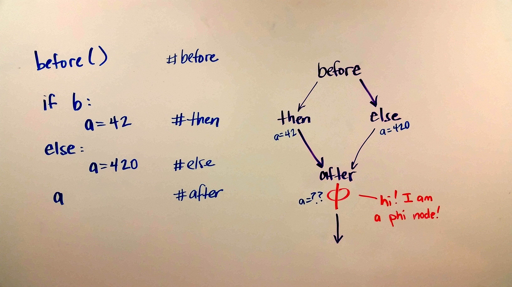
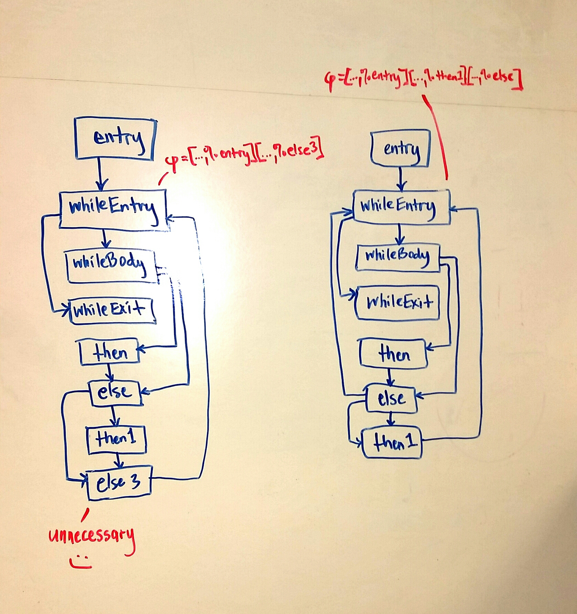
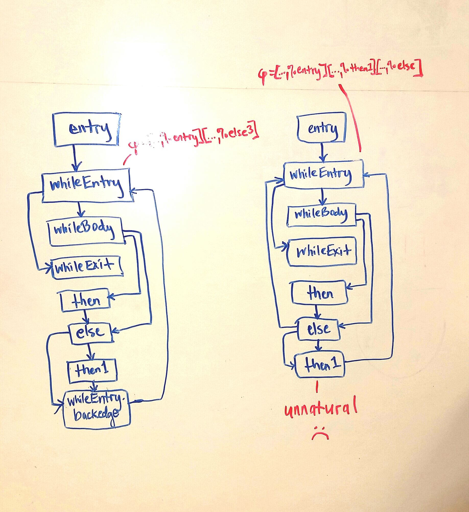

# Factorial: From S-Expressions to LLVM
Hi! We are Celeste and Michael, students in John Regehr's Advanced Compilers course at the University of Utah.

Our class wrote a compiler that takes in s-expressions and outputs LLVM.

John asked us to do an assignment that explains the LLVM compiler's optimization passes over a simple s-expressified program.

This is the program we chose:

```
# ARGS 5
# RESULT 120
(seq (set 1 m0)
     (seq (set 1 m1)
          (while (<= m1 a0)
                 (seq (set (* m0 m1) m0)
                      (seq (set (+ m1 1) m1)
m0)))))
```

It's factorial.

This is the LLVM output for factorial from our compiler, before all of the optimizations:

```
target triple = "x86_64-unknown-linux-gnu"

define i64 @f(i64, i64, i64, i64, i64, i64) {
entry:
  %Mutable0 = alloca i64
  store i64 0, i64* %Mutable0
  %Mutable1 = alloca i64
  store i64 0, i64* %Mutable1
  %Mutable2 = alloca i64
  store i64 0, i64* %Mutable2
  %Mutable3 = alloca i64
  store i64 0, i64* %Mutable3
  %Mutable4 = alloca i64
  store i64 0, i64* %Mutable4
  %Mutable5 = alloca i64
  store i64 0, i64* %Mutable5
  %Mutable6 = alloca i64
  store i64 0, i64* %Mutable6
  %Mutable7 = alloca i64
  store i64 0, i64* %Mutable7
  %Mutable8 = alloca i64
  store i64 0, i64* %Mutable8
  %Mutable9 = alloca i64
  store i64 0, i64* %Mutable9
  store i64 1, i64* %Mutable0
  store i64 1, i64* %Mutable1
  br label %whileEntry

whileEntry:                                       ; preds = %else3, %entry
  %phiNode = phi i64 [ 0, %entry ], [ %16, %else3 ]
  %6 = load i64, i64* %Mutable1
  %lethan = icmp sle i64 %6, %0
  br i1 %lethan, label %whileBody, label %whileExit

whileBody:                                        ; preds = %whileEntry
  %7 = load i64, i64* %Mutable0
  %8 = load i64, i64* %Mutable1
  %9 = call { i64, i1 } @llvm.smul.with.overflow.i64(i64 %7, i64 %8)
  %10 = extractvalue { i64, i1 } %9, 0
  %11 = extractvalue { i64, i1 } %9, 1
  br i1 %11, label %then, label %else

whileExit:                                        ; preds = %whileEntry
  ret i64 %phiNode

then:                                             ; preds = %whileBody
  %calltrap = call i64 @overflow_fail(i64 115)
  br label %else

else:                                             ; preds = %then, %whileBody
  store i64 %10, i64* %Mutable0
  %12 = load i64, i64* %Mutable1
  %13 = call { i64, i1 } @llvm.sadd.with.overflow.i64(i64 %12, i64 1)
  %14 = extractvalue { i64, i1 } %13, 0
  %15 = extractvalue { i64, i1 } %13, 1
  br i1 %15, label %then1, label %else3

then1:                                            ; preds = %else
  %calltrap2 = call i64 @overflow_fail(i64 161)
  br label %else3

else3:                                            ; preds = %then1, %else
  store i64 %14, i64* %Mutable1
  %16 = load i64, i64* %Mutable0
  br label %whileEntry
}

; Function Attrs: nounwind readnone
declare { i64, i1 } @llvm.smul.with.overflow.i64(i64, i64) #0

declare i64 @overflow_fail(i64)

; Function Attrs: nounwind readnone
declare { i64, i1 } @llvm.sadd.with.overflow.i64(i64, i64) #0

attributes #0 = { nounwind readnone }
```

Then we ran this command: `opt -O2 -print-after-all fact.calc.ll`.

And we saw that LLVM made 102 passes over that file. Several of them didn't do anything at all.

:(

So we wrote a Python script that did a diff across those passes so that we could see which passes actually did something. Twelve of them remained.

:)

Now we're going to explain what those twelve passes did.


#Pass 1: SROA

```
entry:
entry:
  %Mutable0 = alloca i64				; I go to a register
  store i64 0, i64* %Mutable0			; I go to a register
  %Mutable1 = alloca i64				; I go to a register
  store i64 0, i64* %Mutable1			; I go to a register
  %Mutable2 = alloca i64				; I go away
  store i64 0, i64* %Mutable2			; I go away
  %Mutable3 = alloca i64				; I go away
  store i64 0, i64* %Mutable3			; I go away
  %Mutable4 = alloca i64				; I go away
  store i64 0, i64* %Mutable4			; I go away
  %Mutable5 = alloca i64				; I go away
  store i64 0, i64* %Mutable5			; I go away
  %Mutable6 = alloca i64				; I go away
  store i64 0, i64* %Mutable6			; I go away
  %Mutable7 = alloca i64				; I go away
  store i64 0, i64* %Mutable7			; I go away
  %Mutable8 = alloca i64				; I go away
  store i64 0, i64* %Mutable8			; I go away
  %Mutable9 = alloca i64				; I go away
  store i64 0, i64* %Mutable9			; I go away
  store i64 1, i64* %Mutable0			; I go away
  store i64 1, i64* %Mutable1			; I go away
  br label %whileEntry
```

SROA turns stack-allocated stuff into register-allocated stuff.
In the very beginning, the compiler allocates all nine (unused) mutable variables onto the stack. The SROA pass takes the only two mutable variables that are actually used in this program--`m0` and `m1`--and puts them into registers.

The above code becomes this:

```
entry:
  br label %whileEntry
```

Then, we drop down to the `whileEntry` block.

In the `whileEntry` block, there are two possible places where `m0` and `m1` could have come from (those would be the `entry` block and the `else3` block). When there are two or more places where a value could have come from, we assign it to a phi node.

>## WTH is a Phi Node?
>
>
>
>In the example above, the variable `a` can have two possible definitions. It needs to have exactly one. This is a requirement of SSA. 
>
>## WTH is SSA?
>
>Static single assignment form (SSA) requires that every variable in intermediate representation code (like LLVM) will be assigned exaclty
once, with one definition. This requirement makes compiler optimizations easier. Unnecessary/unused assignments of variables become more apparent, so they can be removed. This all results because SSA explicitly lays out use-def chains.
>
>#### WTH is a Use-Def Chain?
>A use-def chain is a data structure that shows all of the definitions of a variable that can reach a given use of that variable. In the picture above, the *use* of `a` in the 'after' code is reachable by either *definitions* of `a` in 'then' or 'else'.

A few more lines in the factorial LLVM's `whileBody`, and `else` blocks also get changed because `m0` and `m1` are now in registers.

# Pass 2: Global Variable Optimizer
```
define i64 @f(i64, i64, i64, i64, i64, i64) local_unnamed_addr {
entry:
```
This pass adds `local_unnamed_addr` to the function name above `entry`.

By doing this, the compiler indicates that the address of the function was never taken here in this module (although it could still be taken outside of it).

This analysis recognizes which things can only be called in the current module (say, if they were preceded by `static inline`). Under certain circumstances, this information may allow the compiler to perform optimizations like inlining functions that couldn't have been used anywhere else.

In this case, it doesn't do much for us.

# Pass 3: Combine Redundant Instructions

This was the original `whileEntry` block:

```
whileEntry:                                       ; preds = %else3, %entry
  %Mutable1.0 = phi i64 [ 1, %entry ], [ %10, %else3 ]
  %Mutable0.0 = phi i64 [ 1, %entry ], [ %7, %else3 ]
  %phiNode = phi i64 [ 0, %entry ], [ %7, %else3 ]
  %lethan = icmp sle i64 %Mutable1.0, %0
  br i1 %lethan, label %whileBody, label %whileExit
```

Its last two lines get changed:

```
whileEntry:                                       ; preds = %else3, %entry
  %Mutable1.0 = phi i64 [ 1, %entry ], [ %10, %else3 ]
  %Mutable0.0 = phi i64 [ 1, %entry ], [ %7, %else3 ]
  %phiNode = phi i64 [ 0, %entry ], [ %7, %else3 ]
  %lethan = icmp sgt i64 %Mutable1.0, %0               ; I got changed!
  br i1 %lethan, label %whileExit, label %whileBody    ; I got changed!
```

...in this case, for no good reason.

In general, this analysis tries to combine instructions to make the code smaller. In this case, it seems to prefer a greater-than comparison to a less-equal than comparison--although that doesn't help us much, practically.

# Pass 4: Simplify the CFG

>#### WTH is a CFG?
>A control flow graph (CFG) is a graph representation of all the program points where a program may go during its execution.

There are eight blocks where the program can go in the original code. This pass eliminates one of them and updates the phi nodes accordingly. The following picture shows how the program's CFG gets simplified.



For example, the phi nodes in `whileEntry` take values from either `entry` or `else3`:

```
whileEntry:                                       
%entry
  %Mutable1.0 = phi i64 [ 1, %entry ], [ %10, %else3 ]
  %Mutable0.0 = phi i64 [ 1, %entry ], [ %7, %else3 ]
  %phiNode = phi i64 [ 0, %entry ], [ %7, %else3 ]
```

But when this pass combines the `then1` and `else3` blocks--and allows `else` to go back to `whileEntry`, the phi nodes get updated to take values from `entry`, `then1`, and `else`.

```
whileEntry:                                       ; preds = %else, %then1, %entry
  %Mutable1.0 = phi i64 [ 1, %entry ], [ %10, %then1 ], [ %10, %else ]
  %Mutable0.0 = phi i64 [ 1, %entry ], [ %7, %then1 ], [ %7, %else ]
  %phiNode = phi i64 [ 0, %entry ], [ %7, %then1 ], [ %7, %else ]
```

		

# Pass 5: Tail Call Elimination
>#### WTH is a Tail Call?
>When a function calls another function as its very last action, we call that a tail call. As one example, if a function calls itself as its very last action, it is a tail call--and it is said to be tail-recursive.

When a function calls another function, a new frame is added to the stack. Sometimes, it's unnecessary to do that. If no variables in the current stack are going to be used anywhere else, the program may be able to just jump directly to wherever it wants to go next without creating a new frame. This would save stack space.


In our factorial example, this analysis has found four potential places where it *may* be able to do tail call elimination. However, there are two conditions that need to be satisifed for tail call elimination to occur:

1. The callee does not depend on the caller's stack. (I.e., the second function being called within the first function does not depend on any of the first function's variables.)
2. The callee is called in tail position. (That is, it's the very last thing being done by the caller.)

This pass has determined that only condition 1 can be met in some calls, so it tags those calls with `tail` so that a later pass can decide if it has enough information to satisfy condition 2.

```
%6 = tail call { i64, i1 } @llvm.smul.with.overflow.i64(i64 %Mutable0.0, i64 %Mutable1.0)
...
%calltrap = tail call i64 @overflow_fail(i64 115)
...
%9 = tail call { i64, i1 } @llvm.sadd.with.overflow.i64(i64 %Mutable1.0, i64 1)
...
%calltrap2 = tail call i64 @overflow_fail(i64 161)
```

# Pass 6: Canonicalize Natural Loops
>#### WTH is a Natural Loop?
>A natural loop is a set of nodes that consist of: 1) a header node, and 2) a set of connected nodes with just one back edge to the header node.

This pass does not like any loops that are not natural.

Remember that simplified CFG that we got from pass 4? Its `whileEntry` program point had two back edges coming into it.

This pass does not like what that pass did.

So this pass essentially undoes the work from the previous pass by adding another block called `whileEntry.backedge`:

```
then1:                                            
  %calltrap2 = tail call i64 @overflow_fail(i64 161)
  br label %whileEntry.backedge
whileEntry.backedge:                              
  br label %whileEntry
```

 

Now `whileEntry`, which is the head of the loop, has two entry points: one from `entry` and one from `whileEntry.backedge`. It's a natural loop (again).

```
whileEntry:                                       
%entry
  %Mutable1.0 = phi i64 [ 1, %entry ], [ %10, %whileEntry.backedge ]
  %Mutable0.0 = phi i64 [ 1, %entry ], [ %7, %whileEntry.backedge ]
  %phiNode = phi i64 [ 0, %entry ], [ %7, %whileEntry.backedge ]
```

# PASS 7: Loop-Closed SSA Form Pass
One line changes in this analysis. Originally, we had:

```
whileExit:
  ret i64 %phiNode
```

Now, we have:

```
whileExit:
  %phiNode.lcssa = phi i64 [ %phiNode, %whileEntry ]
  ret i64 %phiNode.lcssa
```

This pass adds phi nodes after any loop. If some other optimization obscures the value of the variables modified by the loop--say, loop unswitching, which creates two or more loops from one loop (It's a long story)--this phi node consolidates them into one reference.

# Pass 8: Rotate Loops
LLVM's LoopRotation.cpp file says "This file implements Loop Rotation Pass."

And in LLVM's Analysis Passes section, which "[...] describes the LLVM Analysis Passes", we have:

>####`-loop-rotate: Rotate Loops`
>A simple loop rotation transformation.

Since this transformation is too intuitive to leave any Google-able explanation, we will leave it unexplained.

...Just kidding.

This pass takes loops of the form:

```
for(i = something_1; i < something_2; i++) {
	; do something
}
```
and it turns them into the form:

```
i = 0
if (i < something_1) {
	v = something_relevant
	do {
	; do something, kind of
	i++;
} while(i < something_2)
```

It does this so that we can lift out values that are re-computed to the same thing every time in the for loop (rather than continuing to re-compute them). Then we stick them in the `if` statement for use in the `do-while` statement that follows.

Without the rotation, it isn't always safe to lift an invariant expression. Take this example: 

```
y = 3;
for (int i = 0; i < n; i++) {
	x += i * (y / n);
}
```

Here, `(y/n)` does not change. But we can't just lift it out in front of the for loop. (What if n = 0?)

Instead, we'll ensure that n > 0 by rewriting it like this:

```
i = 0;
if (i < n) {
	m = y / n;
	do {
	  x += i * m;
	} while (i < n)
}
```

For factorial, this pass transforms the code from this:

```
m0 = 1;
m1 = 1;
while(m1 <= a0) {
	m0 = m0 * m1;
	m1 = m1 + 1;
}
```
to this:

```
m0 = 1;
m1 = 1;
if (1 <= a0) {
	do {
		m0 = m0 * m1;
		m1 = m1 + 1;
	} while (m1 <= a0)
}
```

Sadly, there are no invariant expressions to lift out of the loop in factorial, so this transformation doesn't do us much good.

# Pass 9: Combine Redundant Instructions (again)

This pass decided to switch around the greater-than versus less-than comparisons that pass 3 made.

This is because the canonical form has constants in the right-hand side.

So originally we had this:

```
  %lethan4 = icmp sgt i64 1, %0
```

But now we have this:

```
  %lethan4 = icmp slt i64 %0, 1
```

Bravo.

# Pass 10-12: Canonicalize Natural Loops, Simplify the CFG, Loop-Closed SSA Form Pass
The natural loop looked perfectly canonical to us, but then Pass 10 disagreed and added extra junk. Then pass 11 objected to the extra junk--but it threw out too much. So Loop-Closed SSA Form had to add a bit of the junk back.

We swear none of this was exciting.